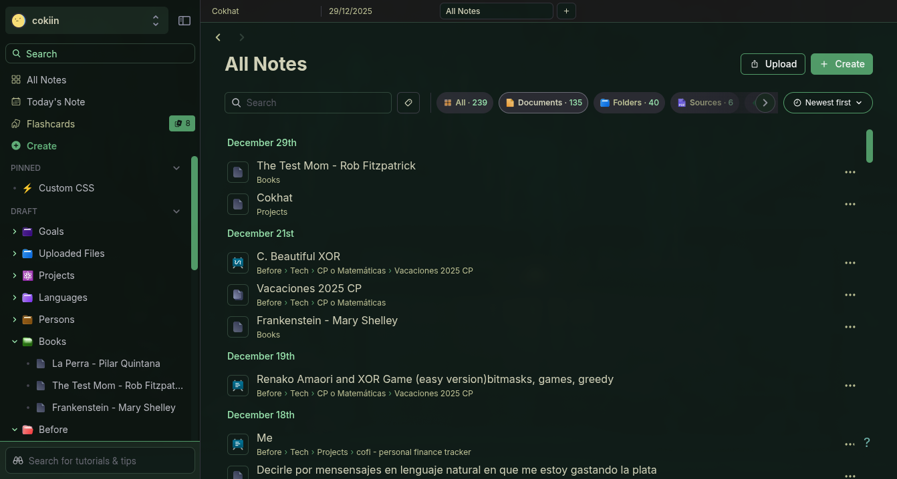
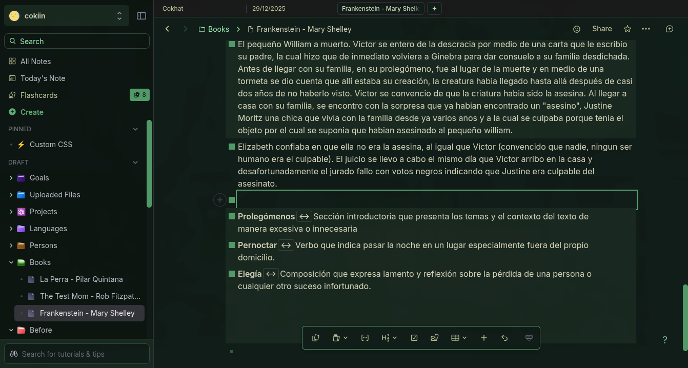
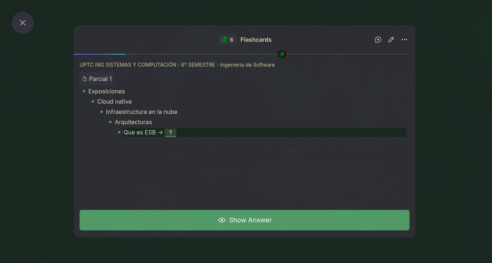
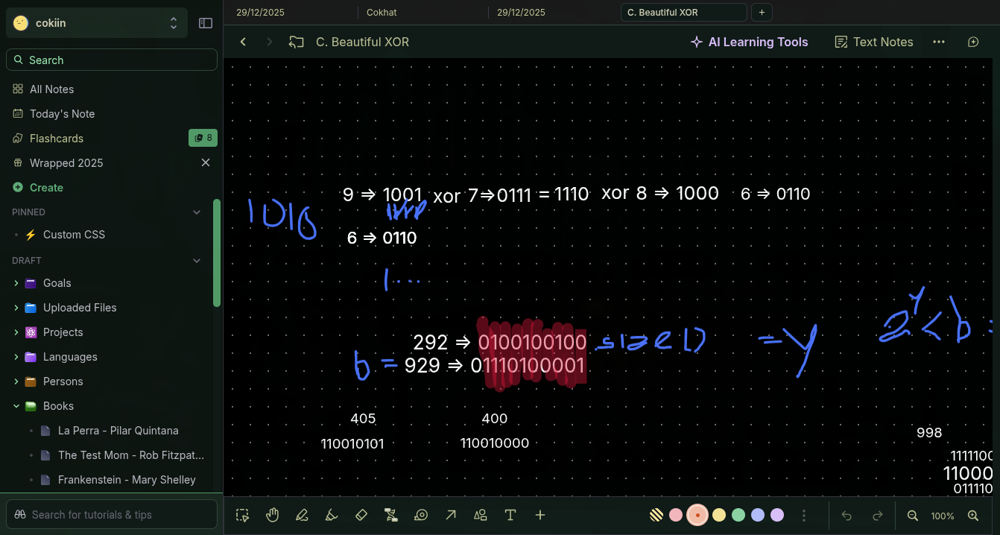

# Osaka Jade - RemNote Theme

A dark theme for RemNote with prominent jade green accents and warm cream text, inspired by Osaka aesthetics.

---

## ✨ Features

- **Prominent Jade Accents**: Solid jade green bullets, borders, and interactive elements throughout the UI
- **Enhanced Readability**: Brightened warm cream text (`#D6D5BC`) for comfortable reading on dark backgrounds
- **Solid Jade Bullets**: Filled circle bullets in jade green (`#549e6a`) with bright jade hover states
- **Bright Jade Links**: Internal references styled with vibrant jade (`#63b07a`) for easy identification
- **Thoughtful Selection**: Selection colors from the Osaka palette (`#364538` background, `#DEB266` text)
- **Comprehensive Coverage**: All RemNote UI components styled with consistent color hierarchy
- **Dark Green-Tinted Background**: Base color `#111c18` with progressive elevation levels
- **Yellow Flashcard Delimiters**: Question/answer separators in bright yellow for visibility

---

## 🎨 Color Palette

Click to expand color palette details

### Background Colors
- **Darkest**: `#0d1612` (sidebars, code blocks)
- **Base**: `#111c18` (main background)
- **Elevated**: `#1a2820`, `#23372B`, `#2a3530` (cards, panels, modals)
- **Selected**: `#364538` (active items)
- **Hover**: `#32473B` (interactive states)

### Text Colors (Brightened for Readability)
- **Primary**: `#D6D5BC` (main text)
- **Secondary**: `#C1C497` (supporting text)
- **Emphasis**: `#F7E8B2` (headings, important text)
- **Bright**: `#F6F5DD` (maximum emphasis)
- **Muted**: `#9EEBB3` (tertiary text)
- **Disabled**: `#53685B` (inactive text)

### Jade Accent Colors (Prominent)
- **Primary**: `#549e6a` (bullets, borders, primary buttons)
- **Bright**: `#63b07a` (links, hover states)
- **Light**: `#76AD98`, `#81B8A8` (subtle accents)
- **Vibrant**: `#72CFA3`, `#9EEBB3` (highlights, success)

### Cyan/Teal Accents
- `#2DD5B7`, `#75BBB3`, `#8CD3CB`, `#ACD4CF` (code syntax, special elements)

### State Colors
- **Error/Red**: `#FF5345`, `#DB9F9C`
- **Warning/Yellow**: `#E5C736`, `#DEB266`
- **Success/Green**: Jade variants

---

## 📸 See It In Action

---

## 🎯 What's Styled

Click to expand comprehensive component list

This theme comprehensively styles all RemNote components:

### Core Editor
- Editor background and text
- Rem bullets (solid jade circles)
- Text selection (warm yellow on jade-tinted bg)
- Add rem buttons
- Fast rem editor

### Navigation & Organization
- Document headers and titles
- Tags (jade borders, yellow text)
- Sidebars (darker background)
- All Notes container
- Document previews
- Navigation bars and panes

### Learning & Flashcards
- Queue container and items
- Flashcard questions and answers
- Delimiters (bright yellow)
- Deck lists and study buttons
- Practice buttons
- Learning goal sliders

### Interactive Components
- Omnibar (prominent jade border)
- Search portal
- Settings modal
- Popups, menus, dialogs
- Buttons (primary jade, secondary outlined)
- Checkboxes (jade when checked)
- Radio buttons
- Switches
- Progress bars (jade gradient)
- Date pickers

### Content Display
- Tables (jade accents on headers and selection)
- Code blocks (dark background, cyan syntax)
- Quotes (jade left border accent)
- Links (bright jade)
- Highlights (yellow selection)
- PDF viewer
- Cards

### Typography
- Headings (brightest text)
- Labels (secondary brightness)
- Paragraphs (primary text)
- Font sizes and weights
- Line heights

### Utility & Polish
- Notifications and toasts (jade borders)
- Banners
- Dividers (subtle jade)
- Scrollbars (jade thumb)
- Focus indicators (jade outline)
- Job indicators
- Account capsule

---

## 💡 Design Philosophy

The Osaka Jade theme follows these principles:

1. **Prominent Jade**: Jade green is used liberally throughout the interface for bullets, borders, buttons, and interactive elements
2. **Warm Contrast**: Cream/yellow text colors provide a warm, comfortable reading experience
3. **Readability First**: Text colors are brightened for better contrast while maintaining aesthetic appeal
4. **Consistent Hierarchy**: Background elevations and text weights follow clear visual patterns
5. **Jade Bullets**: Solid filled circles in jade green are the focal point of the note-taking experience
6. **Yellow Accents**: Tags and flashcard delimiters use warm yellow for complementary contrast
7. **Accessibility**: Focus indicators and selection states are clearly visible

---

## 🛠️ Development

This theme uses:
- **CSS Custom Properties**: All colors defined as CSS variables for easy maintenance
- **RemNote Design Tokens**: Global theming via `.rn-clr-*` classes
- **BEM Methodology**: RemNote's semantic class names (`.rn-editor`, `.rn-rem-bullet`, etc.)
- **Dark Mode Wrapper**: All styles wrapped in `.dark` selector

To modify the theme:
1. Edit `theme.css`
2. Reload the theme in RemNote
3. Test changes across different RemNote components

See `AGENTS.md` for detailed code style guidelines and development practices.

---

## 🤝 Contributing

Contributions are welcome! Please:
1. Follow the code style in `AGENTS.md`
2. Test changes across multiple RemNote views
3. Maintain color consistency with the Osaka Jade palette
4. Update this README if adding major features

---

## 📄 License

This theme is released under MIT License. Feel free to modify and share.

---

## 👤 Author

**elcokiin**

Inspired by the Osaka aesthetic and personal Arch Linux system theme.

---

## 🙏 Acknowledgments

- RemNote team for the extensible theming system and CSS class documentation
- The Osaka color palette that inspired this theme
